<!-- Welcome text -->

<!-- Contact icons -->
<!--

  
  &#8287;&#8287;&#8287;&#8287;&#8287;
  
  &#8287;&#8287;&#8287;&#8287;&#8287;
  

-->

🌱 I’m currently learning and experimenting on:

<!--

-->

## 🛠️ Tech Stack

| Property | Data |
|---|---|
| **Languages** |      |
| **CI / CD** |    |
| **Databases** |  |
| **OS** |   |
| **Tools & Platform** |    |
| **Frameworks and libraries** |    |

💭 My motto? **To infinity and beyond! 👨🏼‍🚀**

---

<h2 align="center"><i>GitHub Stats & Languages Used</i></h2>

  
   
  

---

## ✍️ Random Dev Quote

---

## 👀 Profile Views

---

## 🐍 Contributions Snake

<picture>
  <source media="(prefers-color-scheme: dark)" srcset="./dist/github-snake-dark.svg" />
  <source media="(prefers-color-scheme: light)" srcset="./dist/github-snake.svg" />
  
</picture>
